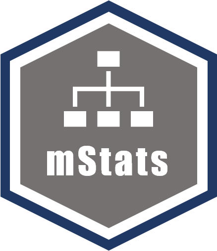

<!-- badges: start -->

<!-- badges: end -->

mStats is a open-source R package to facilitate data analysis with R in
health research. It comprises of three major sets of functions:

-   `data management`
-   `statistical analysis`
-   `calculation of epidemiological measures`

These functions are in turn supported by another set of helper functions
which allows statistical calculation, displaying well-formatted output
and transferring final outputs to process further.

# History

------------------------------------------------------------------------

The package came into life when I started my doctoral study in 2018. I
was inspired a couple of R packages for data manipulation and analysis
including `tidyverse` and `epicalc`, to create something different and
make my life easier. The first version was released on GitHub in late
2018. Initially, it was intended for fun and I wanted to know how much I
could make use of what I have learned R so far.

In the first version of `mStats`, I created some functions to make plots
based on `ggplot2`. I updated several small patch versions adding a few
more functions that were interesting to me at that time. In mid-2019, I
started another package called `stats2` where I tried to simplify the
concept that one function should do a task without too many options. For
example, the `tab` function should perform the task of tabulation with a
few options to tweak its outputs. That’s the whole idea of the package.
I felt that beginners do not mind having only a few options to do so.
They do not use as much as advanced users do.

I continued developing the package with feedback from teachers, friends,
and colleagues. In early 2020, the package seems to become stable.
Hence, on March 31, 2020 I submitted version 3.2.2 to `CRAN`. As times
progress, I hope this package will at least provide some contributions
in some people. Any constructive criticism, suggestions, or comments are
most welcome.

# Basic princples

------------------------------------------------------------------------

The package is developed with the following basic principles kept in
mind.

### 1) `data` as its first input:

It is very common in data analysis to use datasets, either imported or
otherwise. R functions are usually very generic and created for basic
data structures of R. Hence, to use variables from a dataset, there are
two general ways: 1) use the `attach` function and use the names of
variables directly, and 2) to subset data using dollar sign `$` or
square brackets `[]` to provide integer positions of desired variables.
It is best to avoid these usages. Hence, mStats requires data as its
first input / argument. This will help to avoid confusion by using
attach and make the workflow easier. After all, writing words are much
easier than typing complex symbols.

### 2) Keep `functions` short and simple:

Arguments in `mStats` are limited and attempted to keep a balance
between having too many things that can be tweaked and having no options
at all.

### 3) Labels:

When the dataset contains hundreds or thousands of variables, it can get
pretty confusing of what is what. It is better to label those essential
for your data analysis. Hence, mStats keeps up with the concept of
labeling variables and dataset. However, labeling at value level is
deemed as unnecessary in R, and labelling can be implemented at dataset
and variable levels.

### 4) Well-formatted output:

Outputs from each function are tools to communicate with the users, and
they should help users comprehend the outputs with less time and effort.

### 5) Output notification:

Notification is also important to communicate about what has been done
to the dataset. This helps the users check whether the work is properly
implemented.

# Version used

    version
    #>                _                           
    #> platform       x86_64-w64-mingw32          
    #> arch           x86_64                      
    #> os             mingw32                     
    #> system         x86_64, mingw32             
    #> status                                     
    #> major          4                           
    #> minor          1.0                         
    #> year           2021                        
    #> month          05                          
    #> day            18                          
    #> svn rev        80317                       
    #> language       R                           
    #> version.string R version 4.1.0 (2021-05-18)
    #> nickname       Camp Pontanezen
